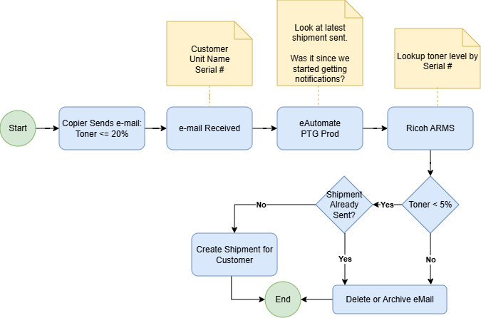

# Patriot Group – Copier Toner to Shipment Workflow



## Overview

This is workflow for toner replenishment for Ricoh copiers managed by Patriot Group. When a copier's toner level drops to 20% or below, it sends an alert to monitored e-mail notifiying an employee that the toner level is low. The employee must use information in the notification email to check on the identified copier and check its toner levels in real time in the Ricoh ARMS system and look for prior shipment history in eAutomate to determine whether a new shipment of toner must be sent to the customer.

---

## Current Flow Steps
### 1. Trigger
- A copier detects its toner level is **≤ 20%** and sends an alert e-mail.

### 2. E-mail Received
- The alert e-mail lands in the monitored inbox, which is read by the employee.

### 3. eAutomate PTG Prod Lookup
- The employee reads the e-mail noting necessary lookup information which includes:
  - **Customer Unit Name**
  - **Serial #**

### 4. Ricoh ARMS Lookup
Using the Serial #, two checks are performed in Ricoh ARMS:
- Retrieve the **latest shipment sent** and determine whether it was created after notifications began.
- Look up the **current toner level** for the unit.

### 5. Decision — Toner < 5%?
The first decision point is met to see whether the toner is low enough to warrant ordering more toner. Currently we are targeting a limit of 5%. If the toner is not lower than that amount, the alert email may be discarded.

| Condition | Path |
|-----------|------|
| Toner **< 5%** | Proceed to shipment-already-sent check |e-mail → End |
| Toner **≥ 5%** | **Delete or Archive** the alert email

### 6. Decision — Shipment Already Sent? 
The employee determines whether the shipment has already been sent for that copier by looking it up in eAutomate.

| Condition | Path |
|-----------|------|
| Shipment **not yet sent** | **Create Shipment for Customer** → End |
| Shipment **already sent** | **Delete or Archive** the alert e-mail → End |

### 7. Create Shipment for Customer
- A toner shipment is created in the system for the customer tied to the copier's serial number.


---

## Decision Logic Summary

```
Toner ≤ 20%  →  lookup unit  →  lookup Ricoh ARMS
    ├── Toner ≥ 5%                         → Delete / Archive eMail → End
    └── Toner < 5%      
            ├── Shipment already sent      → Delete / Archive eMail → End
            └── No shipment sent yet       → Create Shipment → End
```

---

## Pain Points (captured in discovery)

- Employee must context-switch between three systems (email, Ricoh ARMS, eAutomate) to process a single alert.
- No alerts go out when toner is between 5-20% — the only signal is the initial copier email, so a missed or buried email means a missed shipment.
- Manual lookup means no audit trail: if a shipment was missed, there's no log of who checked what and when.
- Process depends on a single employee's availability — no backup if that person is out.
- **Volume TBD** — confirm with client: how many alerts land per day/week and how often is the 5% threshold actually hit?

---

## Volume & Frequency

| Metric | Value |
|--------|-------|
| Frequency | Event-triggered (copier hits ≤ 20% toner) |
| Alerts per day | TBD — confirm with client |
| Alerts that cross 5% threshold | TBD |
| Time per alert (manual) | TBD — estimate ~8-15 min across 3 systems |
| Total weekly hours | TBD |

---

## Expected Automation Flow Steps
Note: These steps will depend on further investigation. So this is mearly the expected flow of automation, until any corrections are made.
### 1. Trigger
- A copier detects its toner level is **≤ 20%** and sends an alert e-mail.

### 2. E-mail Received
- The alert e-mail lands in the monitored inbox (eAutomate PTG Prod).

### 3. eAutomate PTG Prod Lookup
- The system parses the e-mail to extract:
  - **Customer Unit Name**
  - **Serial #**

### 4. Ricoh ARMS Lookup
Using the Serial #, two checks are performed in Ricoh ARMS:
- Retrieve the **latest shipment sent** and determine whether it was created after notifications began.
- Look up the **current toner level** for the unit.

### 5. Decision — Toner < 5%?

| Condition | Path |
|-----------|------|
| Toner **< 5%** | **Delete or Archive** the alert e-mail → End |
| Toner **≥ 5%** | Proceed to shipment-already-sent check |

### 6. Decision — Shipment Already Sent? *(only if Toner ≥ 5%)*

| Condition | Path |
|-----------|------|
| Shipment **not yet sent** | **Create Shipment for Customer** → End |
| Shipment **already sent** | **Delete or Archive** the alert e-mail → End |

### 7. Create Shipment for Customer
- A toner shipment is created in the system for the customer tied to the copier's serial number.

### 8. Delete or Archive eMail
- The processed alert e-mail is deleted or archived to keep the inbox clean.

---

## Decision Logic Summary

```
Toner ≤ 20%  →  lookup unit  →  lookup Ricoh ARMS
    ├── Toner < 5%  (Yes)                  → Delete / Archive eMail → End
    └── Toner ≥ 5%  (No)
            ├── Shipment already sent      → Delete / Archive eMail → End
            └── No shipment sent yet       → Create Shipment → End
```

---

## Systems Involved

| System | Role | Access type |
|--------|------|-------------|
| Copier (Ricoh) | Sends toner-low alert e-mail at ≤ 20% | Email (outbound only) |
| eAutomate PTG Prod | Receives e-mail; resolves Customer Name & Serial # | Web portal / API TBD |
| Ricoh ARMS | Provides current toner level and shipment history | Web portal / API TBD |
| Shipment System | Creates toner shipment orders for customers | Via eAutomate — TBD |

---

## Open Questions / Blockers

- [ ] Does Ricoh ARMS expose an API for toner level and shipment history lookups? Who holds credentials?
- [ ] Does eAutomate PTG Prod have an API for parsing inbound emails and creating supply orders? (ECI Software publishes a REST API — confirm Patriot Group's license includes it.)
- [ ] Is there a sandbox or test environment for eAutomate so we can dry-run shipment creation without sending real orders?
- [ ] What email provider hosts the monitored inbox — Outlook/Exchange? Is Microsoft Graph API access available?
- [ ] What is the acceptable error rate for automated shipment creation? (i.e., is a false positive shipment costly enough to require human review?)
- [ ] Who is the sign-off stakeholder before the automation goes live?

---

## Autonomy Level

| Level | Description |
|-------|-------------|
| **L0** | Fully automated — no human in the loop |
| L1 | Automated with human review before action |
| L2 | AI drafts / prepares — human approves and triggers |
| L3 | Human does it; AI monitors and flags anomalies |

**Target level:** L0

**Rationale:** The decision logic is fully deterministic — two binary checks with no judgment calls. Once API access is confirmed, there is no reason for a human to be in the loop. Risk of a false positive (unnecessary shipment) should be validated with the client against current error rate.

---

## Success Metric

| Metric | Baseline | Target |
|--------|----------|--------|
| Time per alert (employee) | ~8-15 min | 0 min (automated) |
| Alerts processed without human touch | 0% | 100% |
| Missed shipments per month | TBD with client | 0 |
| Inbox backlog (unprocessed alerts) | Unknown | 0 |
